# Phase 2: Enhanced Models Design Document

## Overview

Phase 2 focuses on enhancing the tennis prediction system with advanced player models and AI-powered prediction engines. Building upon Phase 1's data integration layer, this phase introduces sophisticated player modeling that incorporates real-time data, contextual factors, and machine learning algorithms to significantly improve prediction accuracy.

## Technology Stack & Dependencies

| Component | Technology | Purpose |
|-----------|------------|---------|
| Machine Learning | scikit-learn | Classification and regression models |
| Deep Learning | TensorFlow/PyTorch | Neural network implementations |
| Data Processing | pandas, numpy | Statistical analysis and feature engineering |
| Model Persistence | joblib, pickle | Model serialization and loading |
| Validation | cross_validate | Model performance evaluation |

## Enhanced Player Architecture

### Player Model Hierarchy

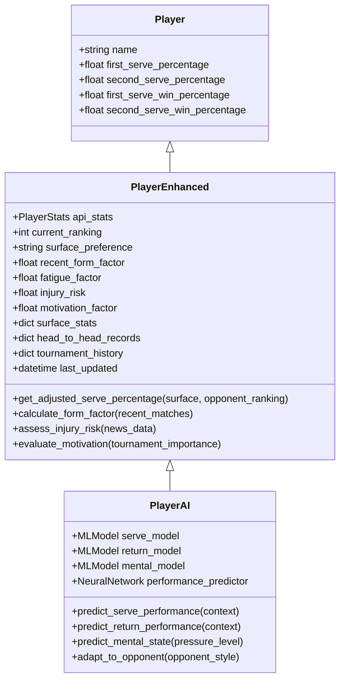

### Core Enhanced Player Model

The `PlayerEnhanced` class extends the base `Player` model with real-time attributes:

| Attribute | Type | Description | Data Source |
|-----------|------|-------------|-------------|
| current_ranking | int | ATP/WTA ranking | Tennis API |
| surface_preference | string | Preferred court surface | Historical analysis |
| recent_form_factor | float | Performance trend (0.5-1.5) | Last 10 matches |
| fatigue_factor | float | Physical condition (0.7-1.0) | Tournament schedule |
| injury_risk | float | Injury probability (0.0-1.0) | News sentiment |
| motivation_factor | float | Tournament importance (0.8-1.2) | Event tier |
| surface_stats | dict | Surface-specific performance | Match history |
| head_to_head_records | dict | Opponent-specific records | Historical data |

### Contextual Performance Calculation

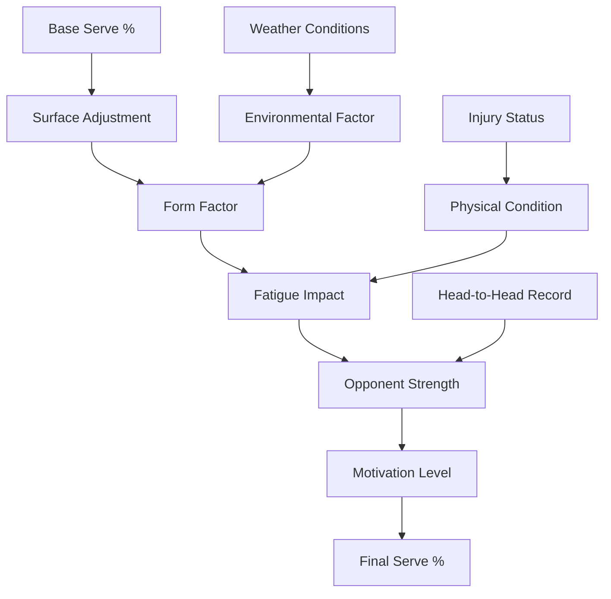

## AI Prediction Engine Architecture

### Multi-Model Prediction System

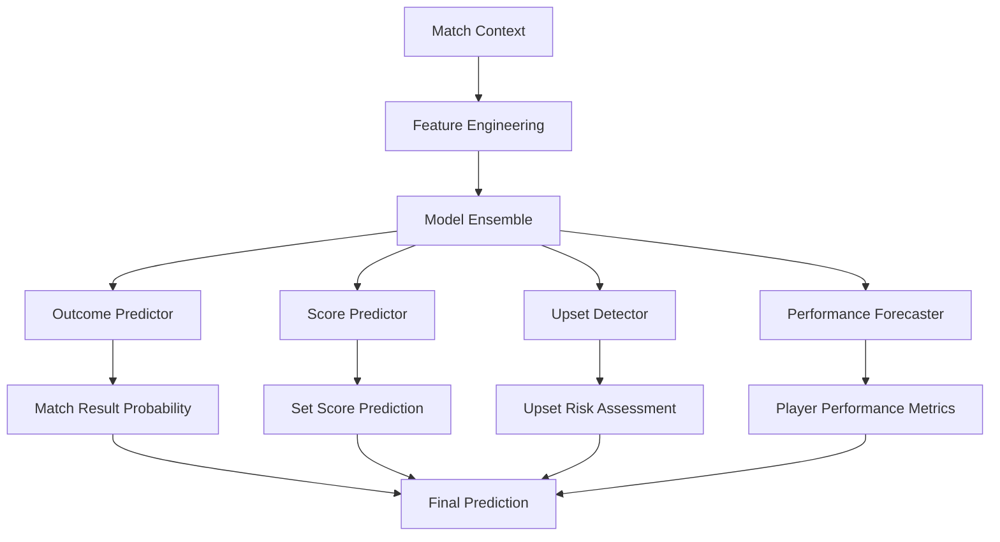

### Feature Engineering Pipeline

| Feature Category | Features | Computation Method |
|------------------|----------|-------------------|
| Ranking Features | ranking_diff, ranking_momentum | Current rankings, trend analysis |
| Form Features | win_rate_last_10, set_ratio_trend | Recent match results |
| Surface Features | surface_win_rate, surface_preference | Historical surface performance |
| Physical Features | fatigue_index, injury_risk | Schedule analysis, news sentiment |
| Contextual Features | h2h_advantage, tournament_importance | Historical data, event tier |
| Statistical Features | serve_dominance, return_efficiency | Performance metrics |

### Machine Learning Models

#### Outcome Prediction Model

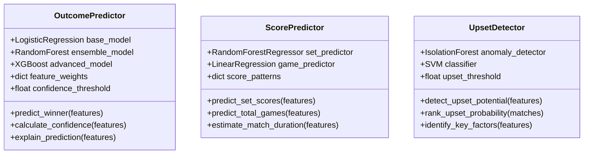

#### Performance Modeling

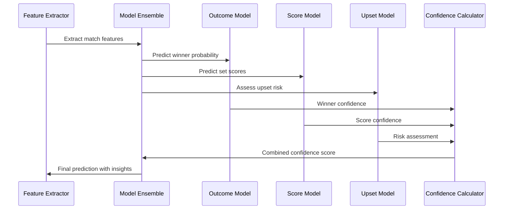

## Enhanced Match Simulation

### Adaptive Simulation Engine

The enhanced simulation engine incorporates real-time factors:

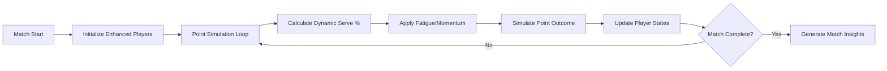

### Dynamic State Management

| State Variable | Update Trigger | Impact |
|---------------|----------------|--------|
| stamina_level | Each game | Serve percentage reduction |
| momentum | Point outcomes | Confidence boost/drop |
| pressure_level | Score situation | Mental strength factor |
| tactical_adaptation | Opponent patterns | Strategy adjustment |

## Model Training Pipeline

### Data Preparation Workflow

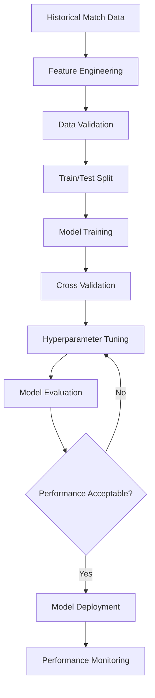

### Training Data Requirements

| Data Type | Source | Volume | Frequency |
|-----------|--------|--------|-----------|
| Match Results | Tennis APIs | 50K+ matches | Daily |
| Player Stats | ATP/WTA | Current rankings | Weekly |
| Surface Performance | Historical data | 10+ years | Static |
| Weather Data | Weather APIs | Tournament locations | Real-time |
| Injury Reports | News APIs | Ongoing monitoring | Hourly |

### Model Validation Strategy

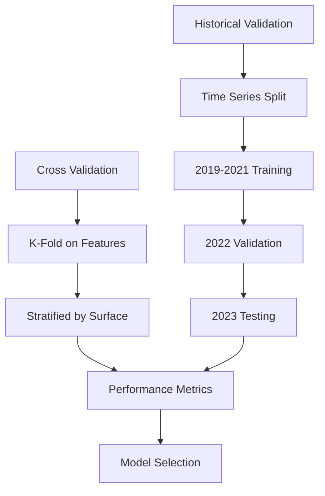

## Integration Architecture

### API Integration Layer

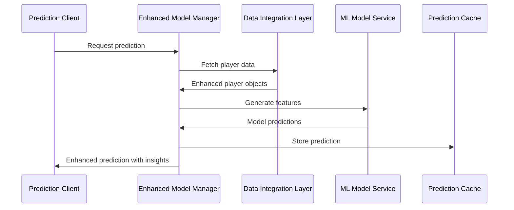

### Model Management System

| Component | Responsibility | Technology |
|-----------|----------------|------------|
| Model Registry | Version control, metadata | MLflow/DVC |
| Feature Store | Feature computation, storage | Redis/PostgreSQL |
| Inference Engine | Real-time predictions | FastAPI/Flask |
| Monitoring Service | Model performance tracking | Prometheus/Grafana |

## Performance Optimization

### Computational Efficiency

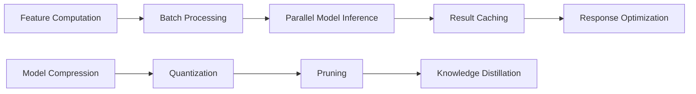

### Caching Strategy

| Cache Level | TTL | Use Case |
|-------------|-----|----------|
| Feature Cache | 1 hour | Player statistics |
| Prediction Cache | 30 minutes | Match predictions |
| Model Cache | 24 hours | Trained models |
| Metadata Cache | 1 week | Tournament data |

## Testing Strategy

### Model Testing Framework

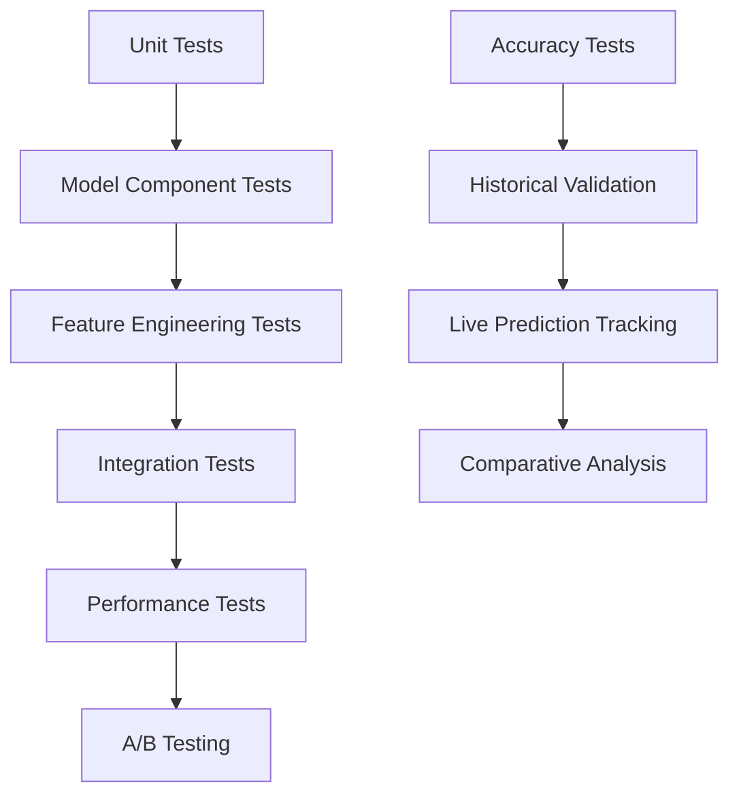

### Validation Metrics

| Metric | Target | Purpose |
|--------|--------|---------|
| Prediction Accuracy | >78% | Overall performance |
| Upset Detection Rate | >65% | Risk assessment |
| Confidence Calibration | <5% error | Reliability |
| Inference Time | <200ms | Real-time requirements |

## Error Handling & Fallbacks

### Graceful Degradation Strategy

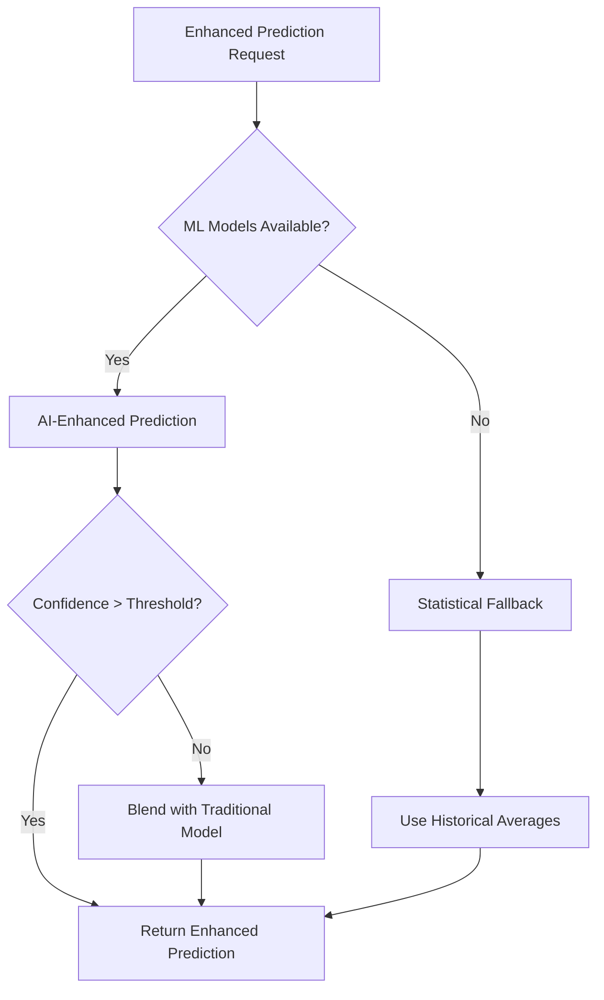

### Monitoring & Alerting

| Alert Type | Condition | Action |
|------------|-----------|--------|
| Model Drift | Accuracy drop >5% | Retrain model |
| Data Quality | Missing features >10% | Switch to fallback |
| API Failures | Error rate >1% | Cache last known good |
| Performance | Response time >500ms | Scale resources |

## Future Enhancement Pathways

### Advanced AI Capabilities

```mermaid
mind
    root((Enhanced Models))
        Deep Learning
            Neural Networks
            Transformer Models
            Reinforcement Learning
        Real-time Adaptation
            Online Learning
            Dynamic Model Updates
            Live Performance Adjustment
        Advanced Analytics
            Causal Inference
            Counterfactual Analysis
            Multi-agent Modeling
        Personalization
            Player-specific Models
            Adaptive Strategies
            Context-aware Predictions
```

This design provides a comprehensive framework for implementing enhanced player models and AI-powered prediction capabilities, ensuring scalability, accuracy, and maintainability while building upon the solid foundation established in Phase 1.